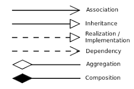
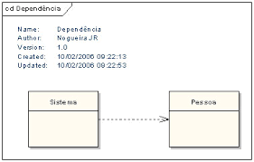
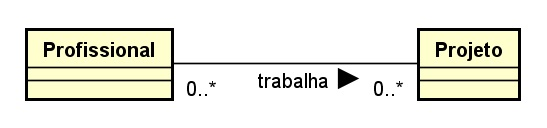
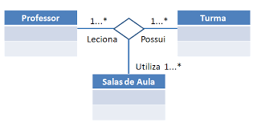
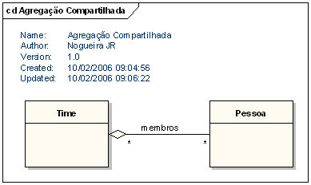
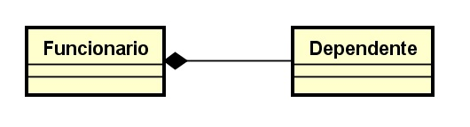
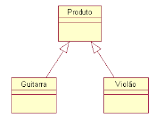
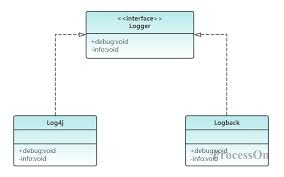
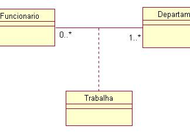

# Diagrama de Classes - Relacionamentos

## Relacionamentos entre classes

Um relacionamento é uma conexão entre itens. Existem váriso tipos de relacionamentos possíveis entre classes

- Dependência
- Associação
- Agregação
- Compisão
- Generalização
- Implementação

### Setas indicando o tipo de relacionamento entre as classes

Cada uma desse relacionamentos possui uma representação gráfica específica

## Relacionamento de Dependência

Dependência fraca, usualmente transiente, que ilustra que uma classe usa informações e serviços de outra classes em algum momento, dependendo dela.

Do tipo "Classe A depende da Classe B".

## Multiplicidade

A multiplicidade é usada para determinar o número mínimo e o número máximo de objetos envolvidos na associação, de cada lado, e também pode especificar o nível de dependência entre os objetos.

|Multiplicidade |Significado     |
|:-------------:|----------------|
|0...1          | No mínimo zero e no máximo um. Indica não-obrigatoriedade do relacionamento.  |
|1...1          | Um e somente um. Um objeto da classe se relaciona com um objeto de outra.     |
|0...*          | Mínimo nenhum e no máximo muitos.                                             |
|1...*          | Mínimo um e no máximo uitos.                                                  |
|*              | Muitos.                                                                       |
|2...7          | Mínimo 2 e no máximo 7. Ou seja, no mínimo duas e no máximo sete instânicas   envolvidos no relacionamentos                                                                   |

## Relacionamento de Associação

Relacionamento mais forte do que a denpendência, indica que a classe mantém uma referência a outra classe ao longo do tempo. As associações podem conectar mais de duas classes.

Do tipo "Classe A tem uma Classe B"

### Tipos de Navegabilidade

A seta representa a **Navegabilidade**, que identifica o sentido em que as informações são transmitidas entre os objetos das classes relacionadas (relacionamento unidirecional). Navegabilidae não é obrigatória no diagrama (relacionamento bidirecional)

#### Navegabilidade unidirecional

#### Navegabilidade bidirecional

A associação pode ter um nome e possui multiplicidade

### Associação Ternário

Associação que conecta objetos de três classes. Um losango indica o ponto de convergência (conexão) das classes envolvidas.

#### Associação Ternária

Na prática, podemos ter associações n-áiras, conectando quaisquer número de objetos de classes.

## Relacionamento de Agregação

Relacionamento mais específico do que a associação, indica que uma classe é um contêiner ou uma coleção de outras classes. As classes contidas não dependem do contêiner - assim, quando o contêiner é destruído, as classes continuam existindo.

Do tipo "Classe A possui uma Classe B"

## Relacionamento de Composição

Variação mais especifica da agregação, este relacionamento indica uma dependência de ciclo de vida forte entre as classes, de modo que quandoum contêiner é destruído, seu conteúdo também o é.

Do tipo "Classe A é parte da classe B".

## Relacionamento de Generalização / Especialização

Relacionamento entre itens gerais (superclasses / classes-mãe) e tipos mais específicos desses itens (subclasses / classes-filhas). Representa a Herança entre classes.

Do tipo "Classe A é um tipo de Classes B"

A classe filha herada propriedades da classe mãe, principalmente atributos e operações, e pode possuir seus próprios.

## Relacionamento de Implementação

Um relacionamento de implementação descreve a relação onde um elemento de software (cliente) implementa o comportamento especificado por outro elemento de modelo (fornecedor), geralmente uma interface.

## Classe Associativa

São produzidas quando ocorrem associações com multiplicidade muito (*) em todas as extremidades. No geral, existem atributos da associação que não podem ser armazenados em nenhuma das classes envolvidas.

## Boas Práticas ao criar diagramas de classe

- O nome da classe deve ser significativo, descrevendo um aspecto real do sistema.
- Os relacionamentos entre os elementos devem ser identificados antes de criar o diagrama.
- Devem ser especificados os atributos e operações de cada classe.
- Sempre que necessário, acrescente anotações para ajudar a definir aspectos das classes ou seus relacionamentos.
