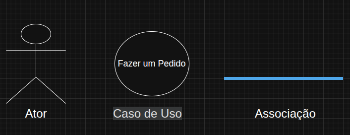
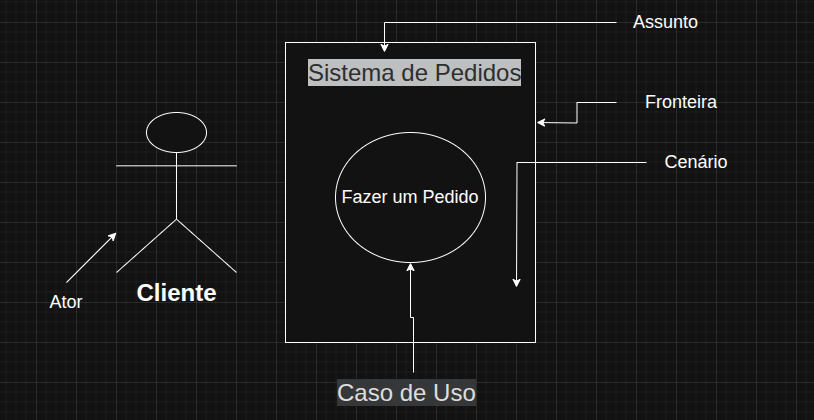
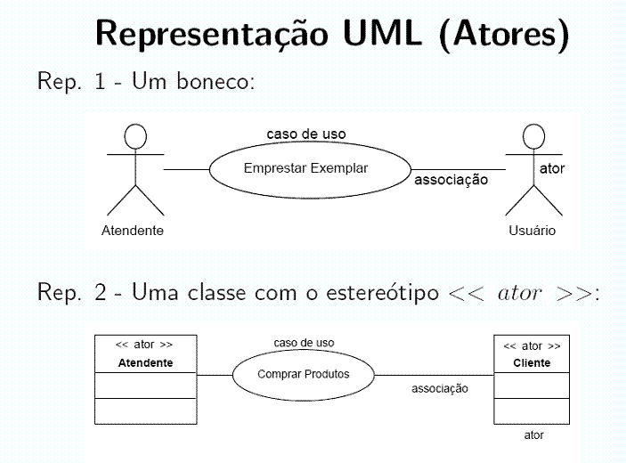
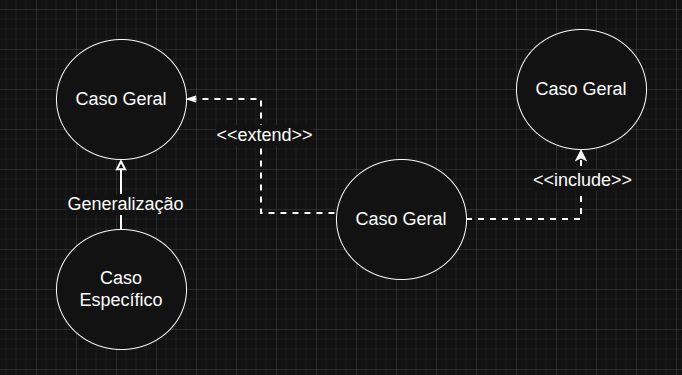
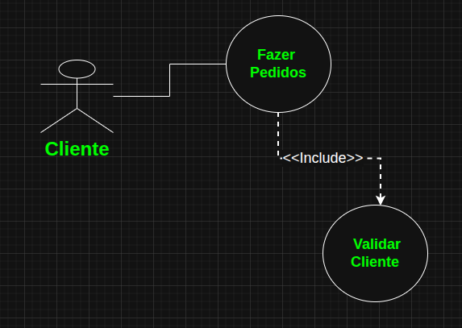
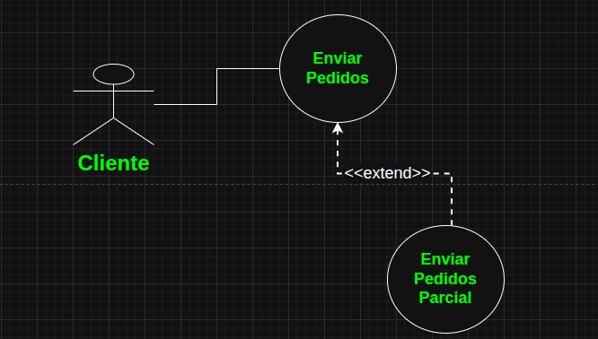
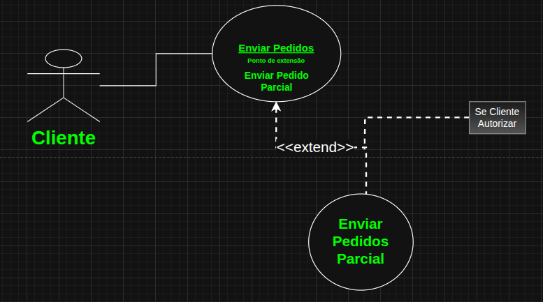
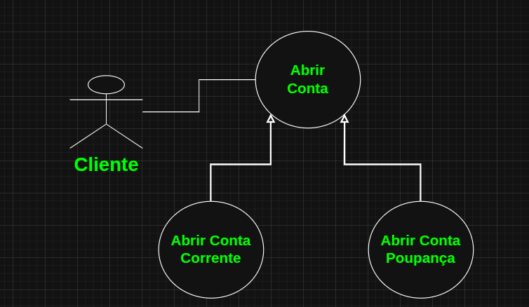
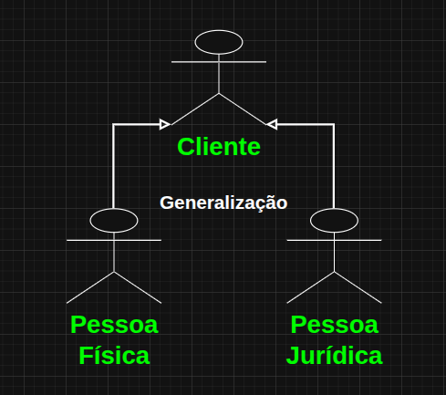

# Diagramas de Casos de Uso

## Diagrams de Casos de Uso

A UML fornece representação gráfica para casos de uso e atores, com sua notação padrão:

|Representação gráfica de um caso de uso|
|:-------------------------------------:|
||
|                                                       |
|                                                       |
|                                                       |
||

## Relacionamento entre Atores e Casos de Uso

- Um ator se relaciona com um Caso de Uso por meio de um relacionametno de Associação

- Abaixo temos as representações de relacionamentos entre casos de uso:

## Relacionamento de Inclusão

Um caso de uso inclui de forma incondicional outro caso de uso.

## Relacionamento de Extensão

Um caso de uso pode estender a funcionalidade de um outro caso de uso. Comportamento opcional.

Podemos também usar Pontos de Extensão e Notas Explicativas:

## Relacionamento de Generalização

A generalização ocorre quando um ator ou caso de uso possui as mesmas características de um elemento base, porém com características específicas.

## Relacionamento entre Atores

Atores podem se relacionar entre si por meio de Generalização

## Boas práticas ao criar diagrams de casos de uso

- Nomes: Use nomes únicos, identificáveis e capazes de identificar seu protósito.
- Fatore variantes, aplicando comportamentos a outros casos que estendem um caso de uso
- Sempre descreva o fluxo de eventos da meneira mais clara possível, de modo que observadores externos possam compreendê-los.
- Exiba somente os casos de uso importantes para a compreensão do comportamentos do sistema (ou parte dele)
- Idem com relação aos atores.
- Distribua os elementos no diagrama de forma a minimizar o cruzamentos de linhas, que interfere na compreensão
- Organize os elemtos que têm comportamentos e papéis relacionados próximos entre si.
- Faça uso de notas e cores diferentes como indicações visuais para ressaltar características importantes.
- Caso relacionamentos de inclusão e exxtensão fiquem muito complicados, os exiba em um outro diagrama complementar.
