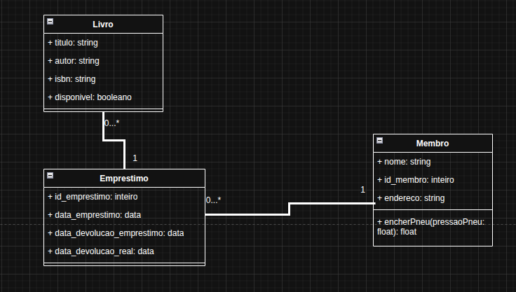
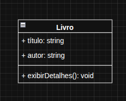
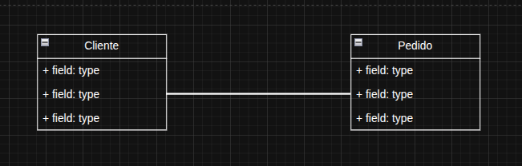
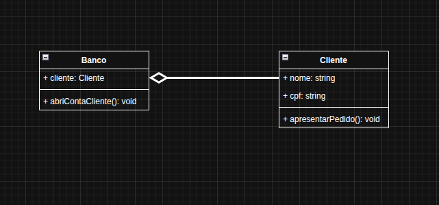
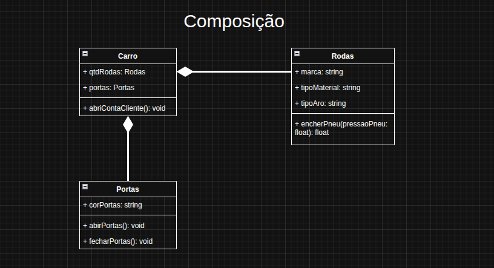

# UML

## Exercícios sobre Diagramas de Classes da UML

### Conceitos de Diagramas de Classe (11 - 30)

1. O que é uma classe em UML? Liste seus três compartimentos.
    - Uma classe é um modelo que define as propriedades (atributos) e o comportamento (métodos) de um tipo de objeto, representada por uma retângulo com três compartimentos: o superior para o nome da classe, o do meio para seus atributos, e o inferior para suas operações(métodos).
1. Crie uma classe `Livro` com os atributos `título` e `autor`.

1. Adicione o método `exibirDetalhes()` à classe `Livro`.

1. Explique a diferença entre um atributo público (`+`), privado (`-`) e protegido (`#`).
    - Público: todos tem acesso
    - Privado: só a classe tem acesso
    - Protegido: só a classe e as subclasses tem acesso.
1. Defina a relação de **Associação**. Dê um exemplo.
    - Na UML, uma associação é uma relação estrutural entre dois classificadores (como classes) que indica que objetos de um podem se conectar e navegar para objetos de outro. Elas é representada por uma linha sólida entre as classes e pode incluir informações como multiplicidade (quantas instâncias de uma classe se relacionam com outras) e navegabilidade (a direção do fluxo de ifnromação). Um exemplo comum é a associação entre uma classes cliente e uma classe Conta, onde cada Cliente pode ter uma ou mais Contas, e cada Conta pertence a um único Cliente.
    - Como determinar que um relacionaemnte é uma Associação:
        1. Procure por um vínculo estrutural: Se dois classificadores (classes, cados de uso, etc.) estão conectados e interagem, mas não são parte de um hierarquia (generalização) ou um objeto é parte integrante de outro (agregação/composição), a conexão é uma associação.
        2. Use frases de associação: Pergunte se faz sentido dizer frases como:
            - "Um cliente conhece um produto".
            - "Um aluno se matricula em um curso".
            - "Um motorista dirige um carro".
        3. Observe a falta de um "todo-parte" forte: A agregação e a composição são tipos especificos de associação onde há um relacionaemnto de "todo-parte"
            - Um relacionamento "todo-parte" significa que um objeto (o todo) é composto por outros objetos (as partes).
            - Na agregação, a parte pode existir independentemente do todo (um motor pode ser usado por vários carros.)
            - Na composição, a parte depende totalmente do todo; se o todo é destruído, a parte também é (uma sala é parte de um edifício).
            - Se não houver esse relação intriseca de todo-parte, é uma associação simples.
        4. Identifique a linha sólida: Em um diagrama de classes UML, uma associação é visualmente representada pro uma linha sólida entre dois classificadores.
            - Classificadores são elementos de modelo que descreve um conjutno de instãncias (ou objeto) com caracterísitcas e comportamentos semelhantes, sendo um termo genérico para elementos como:
                - classes
                - interfaces
                - tipos de dados
                - enumerações
                - e outros que podem ter aatributos (dados) e oeprações (comportamentos).
        5. Verifique a navegabilidade(opcional): Uma associação pode ser bidirecional (sem setas ou com setas em ambos os lados) ou unidirecional (com uma seta indicando a direção do fluxo de controle, como em "<<<<->>>>")
1. Represente a relação entre as classes `Cliente` e `Pedido`. Qual a cardinalidade?

1. O que é **Associação de Agregação**? Dê um exemplo e desenhe o símbolo.
    - A agregação é um tipo de relação "todo/parte" (ou "tem um/tem muitos") em que um objeto (as "partes"), mas estas parte podem existir de forma independente do todo. Ela representa um associaçãomais fraca do que a composição, pois o ciclo de vida do objeto contido não depende do objeto que o contém. O símbolo de agregação em um diagrama UML é uma linha sólida com um losango vazio na extermidade do todo.
    - O losango toca o objeto que é considerado o todo do relacionamento.
    - 
1. O que é **Associação de Composição**? Dê um exemplo e desenhe o símbolo.
    - É um tipo de relacionamento forte entre classes, onde uma classe (o todo) é composta por outra classe (a parte), e a parte não pode existir independentemente do todo. Essa relação é definida pela dependência da vida de um objeto, significando que se o objeto "pai" for exluído, os objetos "filhos" que o compõem também deixarão de existir.
    - Características da COmposição:
        - **Realação "todo-parte"**: O objeto contido é uma parte integrante do objeto que o contém.
        - **Dpendência de vida**: A vida do objeto-parte está ligada à vida do objeto-todo.
        - **Inexistência independente**: A parte não pode existir sem o todo que a contém.
    - 
1. Qual a principal diferença entre Agregação e Composição?
    - A principal diferença é o ciclo de vida dos objetos envolvidos: na agregação, as partes podem existir independentemente do todo, enquanto na composição a parte depende inteiramente do todo para existir.
    - Agregação
        - **Relação fraca**: Representa uma relação "todo/parte" mais flexível.
        - **Independência das partes**: Os objetos-parte podem existir por si só e não são exclusivamente de um único objeto-todo.
        - **Exemplo**: Um time (todo) é formado por atletas (parte). Os atletas podem existir e fazer parte de outros times, mesmo que o time atual seja desfeito.
    - Composição
        - **Relação forte**: Representa uma relação "todo/parte" onde há um forte vínculo entre eles.
        - **Dependências das partes**: As partes não podem existir sem o todo que as contém.
        - **Relação de morte**: A destruição do objeto-todo implica a destruição dos seus objetos-parte.
        - **Exemplo**: Um pedido (todo) é composto por itens (parte). Se o pedido for cacelado, os itens associados a ele também são destruídos e não têm mais propósito.
1. Crie um diagrama de classes para um sistema de biblioteca com as classes `Livro`, `Membro` e `Empréstimo`.
1. Explique a relação de **Generalização (Herança)**.
1. Modele a relação de herança entre `Animal`, `Cachorro` e `Gato`.
1. O que é a relação de **Realização (Implementação)**?
1. Modele a relação onde a classe `Carro` implementa a interface `Dirigível`.
1. Crie um diagrama de classes para um sistema de e-commerce com as classes `Produto`, `CarrinhoDeCompras` e `ItemDoCarrinho`.
1. Adicione a classe `Pagamento` ao diagrama do e-commerce.
1. Modele a relação entre uma classe `Curso` e a classe `Aluno`. Considere que um curso pode ter muitos alunos.
1. Adicione um atributo estático `proximoId` à classe `Pedido`.
1. Crie um diagrama de classes para um sistema de gerenciamento de hotel com `Quarto`, `Hóspede` e `Reserva`.
1. Adicione a classe `ServiçoAdicional` (como café da manhã ou spa) ao diagrama do hotel e a relacione com `Reserva`.

---
