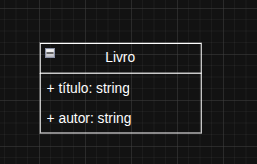
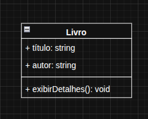
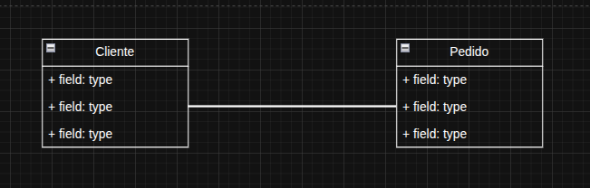
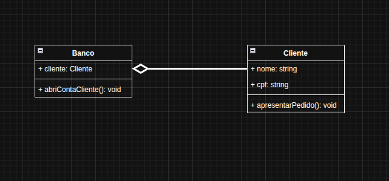
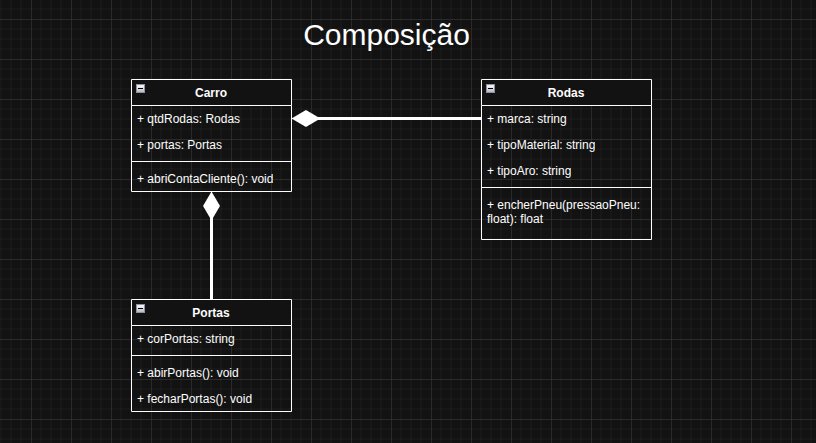

# UML

## 100 Exercícios sobre UML

### [Conceitos Fundamentais (1-10)](./Exercicios-UML/Conceitos-Fundamentais.md)

### 2. Diagrama de Classes (11-30)

1. O que é uma classe em UML? Liste seus três compartimentos.
    - Uma classe é um modelo que define as propriedades (atributos) e o comportamento (métodos) de um tipo de objeto, representada por uma retângulo com três compartimentos: o superior para o nome da classe, o do meio para seus atributos, e o inferior para suas operações(métodos).
1. Crie uma classe `Livro` com os atributos `título` e `autor`.

1. Adicione o método `exibirDetalhes()` à classe `Livro`.

1. Explique a diferença entre um atributo público (`+`), privado (`-`) e protegido (`#`).
    - Público: todos tem acesso
    - Privado: só a classe tem acesso
    - Protegido: só a classe e as subclasses tem acesso.
1. Defina a relação de **Associação**. Dê um exemplo.
    - Na UML, uma associação é uma relação estrutural entre dois classificadores (como classes) que indica que objetos de um podem se conectar e navegar para objetos de outro. Elas é representada por uma linha sólida entre as classes e pode incluir informações como multiplicidade (quantas instâncias de uma classe se relacionam com outras) e navegabilidade (a direção do fluxo de ifnromação). Um exemplo comum é a associação entre uma classes cliente e uma classe Conta, onde cada Cliente pode ter uma ou mais Contas, e cada Conta pertence a um único Cliente.
    - Como determinar que um relacionaemnte é uma Associação:
        1. Procure por um vínculo estrutural: Se dois classificadores (classes, cados de uso, etc.) estão conectados e interagem, mas não são parte de um hierarquia (generalização) ou um objeto é parte integrante de outro (agregação/composição), a conexão é uma associação.
        2. Use frases de associação: Pergunte se faz sentido dizer frases como:
            - "Um cliente conhece um produto".
            - "Um aluno se matricula em um curso".
            - "Um motorista dirige um carro".
        3. Observe a falta de um "todo-parte" forte: A agregação e a composição são tipos especificos de associação onde há um relacionaemnto de "todo-parte"
            - Um relacionamento "todo-parte" significa que um objeto (o todo) é composto por outros objetos (as partes).
            - Na agregação, a parte pode existir independentemente do todo (um motor pode ser usado por vários carros.)
            - Na composição, a parte depende totalmente do todo; se o todo é destruído, a parte também é (uma sala é parte de um edifício).
            - Se não houver esse relação intriseca de todo-parte, é uma associação simples.
        4. Identifique a linha sólida: Em um diagrama de classes UML, uma associação é visualmente representada pro uma linha sólida entre dois classificadores.
            - Classificadores são elementos de modelo que descreve um conjutno de instãncias (ou objeto) com caracterísitcas e comportamentos semelhantes, sendo um termo genérico para elementos como:
                - classes
                - interfaces
                - tipos de dados
                - enumerações
                - e outros que podem ter aatributos (dados) e oeprações (comportamentos).
        5. Verifique a navegabilidade(opcional): Uma associação pode ser bidirecional (sem setas ou com setas em ambos os lados) ou unidirecional (com uma seta indicando a direção do fluxo de controle, como em "<<<<->>>>")
1. Represente a relação entre as classes `Cliente` e `Pedido`. Qual a cardinalidade?

1. O que é **Associação de Agregação**? Dê um exemplo e desenhe o símbolo.
    - A agregação é um tipo de relação "todo/parte" (ou "tem um/tem muitos") em que um objeto (as "partes"), mas estas parte podem existir de forma independente do todo. Ela representa um associaçãomais fraca do que a composição, pois o ciclo de vida do objeto contido não depende do objeto que o contém. O símbolo de agregação em um diagrama UML é uma linha sólida com um losango vazio na extermidade do todo.
    - O losango toca o objeto que é considerado o todo do relacionamento.
    - 
1. O que é **Associação de Composição**? Dê um exemplo e desenhe o símbolo.
    - É um tipo de relacionamento forte entre classes, onde uma classe (o todo) é composta por outra classe (a parte), e a parte não pode existir independentemente do todo. Essa relação é definida pela dependência da vida de um objeto, significando que se o objeto "pai" for exluído, os objetos "filhos" que o compõem também deixarão de existir.
    - Características da COmposição:
        - **Realação "todo-parte"**: O objeto contido é uma parte integrante do objeto que o contém.
        - **Dpendência de vida**: A vida do objeto-parte está ligada à vida do objeto-todo.
        - **Inexistência independente**: A parte não pode existir sem o todo que a contém.
    - 
1. Qual a principal diferença entre Agregação e Composição?
    - A principal diferença é o ciclo de vida dos objetos envolvidos: na agregação, as partes podem existir independentemente do todo, enquanto na composição a parte depende inteiramente do todo para existir.
    - Agregação
        - **Relação fraca**: Representa uma relação "todo/parte" mais flexível.
        - **Independência das partes**: Os objetos-parte podem existir por si só e não são exclusivamente de um único objeto-todo.
        - **Exemplo**: Um time (todo) é formado por atletas (parte). Os atletas podem existir e fazer parte de outros times, mesmo que o time atual seja desfeito.
    - Composição
        - **Relação forte**: Representa uma relação "todo/parte" onde há um forte vínculo entre eles.
        - **Dependências das partes**: As partes não podem existir sem o todo que as contém.
        - **Relação de morte**: A destruição do objeto-todo implica a destruição dos seus objetos-parte.
        - **Exemplo**: Um pedido (todo) é composto por itens (parte). Se o pedido for cacelado, os itens associados a ele também são destruídos e não têm mais propósito.
1. Crie um diagrama de classes para um sistema de biblioteca com as classes `Livro`, `Membro` e `Empréstimo`.
1. Explique a relação de **Generalização (Herança)**.
1. Modele a relação de herança entre `Animal`, `Cachorro` e `Gato`.
1. O que é a relação de **Realização (Implementação)**?
1. Modele a relação onde a classe `Carro` implementa a interface `Dirigível`.
1. Crie um diagrama de classes para um sistema de e-commerce com as classes `Produto`, `CarrinhoDeCompras` e `ItemDoCarrinho`.
1. Adicione a classe `Pagamento` ao diagrama do e-commerce.
1. Modele a relação entre uma classe `Curso` e a classe `Aluno`. Considere que um curso pode ter muitos alunos.
1. Adicione um atributo estático `proximoId` à classe `Pedido`.
1. Crie um diagrama de classes para um sistema de gerenciamento de hotel com `Quarto`, `Hóspede` e `Reserva`.
1. Adicione a classe `ServiçoAdicional` (como café da manhã ou spa) ao diagrama do hotel e a relacione com `Reserva`.

---

### 3. Diagrama de Casos de Uso (31-50)

1. O que é um **Ator** em um diagrama de casos de uso?
1. O que é um **Caso de Uso**?
1. Qual a função da fronteira do sistema?
1. Identifique os atores e os casos de uso para um sistema de banco online.
1. Identifique os atores e os casos de uso para um sistema de caixa eletrônico.
1. Explique a relação `include`. Quando ela deve ser usada?
1. Modele os casos de uso `Comprar Produto` e `Processar Pagamento`, usando a relação `include`.
1. Explique a relação `extend`. Quando ela deve ser usada?
1. Modele os casos de uso `Comprar Produto` e `Comprar Parcelado`, usando a relação `extend`.
1. Qual a diferença entre as relações `include` e `extend`?
1. Identifique os atores e casos de uso para um sistema de aluguel de filmes online.
1. Modele o caso de uso `Acessar Relatório de Vendas`. Inclua um ator `Gerente`.
1. Adicione o caso de uso `Gerar Relatório de Vendas` ao exercício anterior.
1. Identifique atores e casos de uso para um sistema de agendamento de consultas médicas.
1. Modele o caso de uso `Agendar Consulta`, usando `include` para o caso de uso `Verificar Disponibilidade`.
1. Modele o caso de uso `Agendar Consulta`, usando `extend` para o caso de uso `Enviar Lembrete`.
1. Identifique os atores e casos de uso para um sistema de biblioteca.
1. Modele o caso de uso `Fazer Empréstimo`. Use a relação `include` para `Verificar Status de Membro`.
1. Identifique os atores e casos de uso para um sistema de controle de tráfego aéreo.
1. Adicione um caso de uso `Notificar Atraso de Voo` ao exercício anterior, usando a relação `extend`.

---

### 4. Diagrama de Sequência (51-70)

1. O que é uma **Linha de Vida (Lifeline)**?
1. O que é uma **Mensagem**? Dê exemplos.
1. O que representa uma **Barra de Ativação (Activation Bar)**?
1. Modele uma interação de login: um `Usuário` envia uma mensagem de `login(usuario, senha)` para a `Tela de Login`. A tela envia uma mensagem para o `Sistema de Autenticação`.
1. Crie um diagrama de sequência para a compra de um produto: `Cliente` -> `Carrinho` -> `SistemaDePagamento`.
1. O que é um **fragmento de ciclo (loop)**?
1. Modele uma iteração em um diagrama de sequência que representa um `loop` de compra de vários produtos.
1. O que é um **fragmento de alternativa (alt)**?
1. Modele uma `alt` para um login que pode ser `bem-sucedido` ou `falhar`.
1. O que é um **fragmento opcional (opt)**?
1. Modele uma ação opcional de `enviar e-mail de confirmação` após a compra.
1. Crie um diagrama de sequência para o processo de um empréstimo, onde o `Cliente` interage com o `Sistema`, que por sua vez interage com o `Gerente`.
1. Modele uma interação onde um `Serviço` invoca o método de outro `Serviço` em um ambiente de microsserviços.
1. Adicione um fragmento `opt` para `solicitarCupom()` à sequência de compra do exercício 55.
1. Crie um diagrama de sequência para o envio de uma mensagem em um chat: `Remetente` -> `Servidor` -> `Destinatário`.
1. Modele uma sequência onde um `Gateway` distribui uma mensagem para vários `Serviços` (use o fragmento `par`).
1. Crie um diagrama de sequência para um cadastro de usuário, incluindo a `Tela de Cadastro` e o `Sistema de Usuários`.
1. Adicione um `alt` para `usuário já existe` no diagrama do exercício 67.
1. Modele uma interação entre um cliente, a interface e o banco de dados para a busca de um produto.
1. Crie um diagrama de sequência para um processo de reset de senha.

---

### 5. Diagrama de Atividades (71-85)

1. Qual o propósito de um diagrama de atividades?
1. O que são os nós de **Ação (Action)** e de **Atividade (Activity)**?
1. O que é um nó de **Decisão (Decision Node)**?
1. O que é um nó de **Fusão (Merge Node)**?
1. Modele um fluxo de atividade para o processo de login, com uma decisão para "credenciais válidas".
1. Modele um fluxo de atividade para o processo de um pedido, com ações para `Verificar Estoque`, `Processar Pagamento` e `Enviar Pedido`.
1. O que são os nós de **Divisão (Fork)** e **Junção (Join)**?
1. Modele um fluxo de atividade que executa `Enviando E-mail de Confirmação` e `Atualizando o Estoque` em paralelo.
1. Modele um fluxo de atividade para o processo de um `download` de arquivo que pode ser cancelado a qualquer momento.
1. Modele um fluxo de atividade para o processo de um empréstimo bancário, com uma decisão para "aprovar" ou "rejeitar".
1. Modele um fluxo para um processo de votação online.
1. Use `lanes` para modelar um fluxo de atividade onde um `Cliente` e o `Sistema` interagem.
1. Crie um diagrama de atividade para o processo de agendamento de consultas médicas.
1. Adicione uma decisão ao diagrama do exercício 83 para `cancelamento` da consulta.
1. Modele o fluxo de um processo de compras online, incluindo a navegação, seleção de produtos e pagamento.

---

### 6. Diagrama de Máquina de Estado (86-100)

1. O que é um estado em um diagrama de máquina de estado?
1. O que é uma **Transição (Transition)**?
1. Explique a diferença entre um evento e uma ação em um diagrama de máquina de estado.
1. Modele o ciclo de vida de uma `Lâmpada` com os estados `Ligada` e `Desligada`.
1. Modele o ciclo de vida de um `Pedido` em um sistema de e-commerce, com os estados `Aguardando Pagamento`, `Pago`, `Enviado` e `Entregue`.
1. Qual a função de um estado de **início** e de **fim**?
1. O que é uma **condição de guarda (guard condition)**?
1. Modele uma transição de estado de `Aguardando Pagamento` para `Pago` com uma condição de guarda `[valor > 0]`.
1. O que é uma ação de **entrada (entry)** e de **saída (exit)**?
1. Adicione uma ação de `entry` para `enviar e-mail de confirmação` ao estado `Pago` do exercício 90.
1. Modele o ciclo de vida de um `Ticket de Suporte` com os estados `Aberto`, `Em Andamento`, `Resolvido` e `Fechado`.
1. Modele o ciclo de vida de um `Leilão Online` com os estados `Aberto`, `Em Andamento` e `Encerrado`.
1. Modele o ciclo de vida de uma `Reserva de Voo`, considerando os estados `Reservado`, `Confirmado` e `Cancelado`.
1. Modele o ciclo de vida de um `Semáforo` em um cruzamento, incluindo os estados `Verde`, `Amarelo` e `Vermelho` com seus respectivos temporizadores.
1. Modele o ciclo de vida de um `Robô Aspirador`, com os estados `Parado`, `Aspirando` e `Carregando`.
