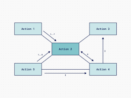
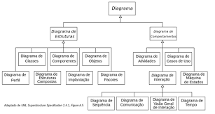

# UML

## O que é UML ?

Trata-se de uma linguagem unificada que habilita profissionais de TI a modelar documentar aplicações de software.

Em termos de design, a UML oferece um meio de visualizar a arquitetura de um sistema por meio de **diagrama**, incluindo atividade, componentes individuais do sistema, a interação desse componentes, interafaces, interação com o mundo externo, entre outras.

É importante notar que a UML não é um método de desenvolvimento em si, e é independente de plataforma/linguagem.

## Termos-chaves

**Rational Sofware**: Empresa que fornecia ferramenteas para prática de engenharia de software. Vendidad para a IBM em 2003.

**OMG:** Consórcio internacional de padrões da indústria de componentes, sem fins lucrativos, com representantes do governo, indústria e academia. Fornece especificações para padrões(mas não implementações). Áreas de atuação da OMG incluem sistemas financeiros, de saúde, armazenamento de dados, blockchain, IoT, cibersegurança e astronomia.

**Diagrama**: Representçaõ gráfica (geralmente parcial) do modelo de um sistema.

## Histórico

- UML - Unified Modeling Language/ Linguagem de Modelagem Unificada - é uma linguagem de  modelagem de propósito geral, para desenvolviemnto em engenharia de software, que permite visualizar de uma forma padronizada o projeto (design) de um sistema.

- Desenvolvida por **Grady Booch, Ivar Jacobson** e **James Rumbaugh** quando trabalhavam na Rationa Software entre 1994 e 1995.
- O Object Management Group (OMG) adotou a UML como linguagem padrão em 1997, e em 2005 foi publicada pela ISO como um padrão aprovado.
- Décadas de 70 e 80
  - Análise e Projeto estruturado de Sistemas
  - Domínio das linguagem procedurais
- Final dos anos 80
  - Análise e Projeto de Sistemas Orientados a Objetos
  - Técnicas de Modelagem variadas
  - Sem Padronização
- 1997
  - OMG padroniza o UML 1.0
  - Em novembro/1997 é lançado o UML 1.1 pela Rational

## O que um Diagrama representa ?

Os diagramas representam duas visões distintas de um modelo de sistema:

- **Estática** (estrutural) - estrutura estática por meio de objetos, operações, relações e atributos.
- **Dinâmico** (comportamental) - comportamento dinâmico por meio de colaboração entre os objetos e mudanças de seus estados internos.

## Diagrama UML

### Estruturais

- Classes
- Objetos
- Pacotes
- Componenetes
- Implantação
- Estrutura Composta
- Perfil

### Comportamentais

- Caso de Uso
- Sequência
- Comunicação
- Máquina de Estado
- Atividade
- Visão Geral de Interação
- Temporização

## Categorias de Diagramas

## Quem se beneficia dos diagramas UML ?

- Proprietário do Produto
- Analista de negócios
- Analista de Sistemas
- Operadores do Sistema
- Desenvolvedor/Programador
- Gerentes de Qualidade
