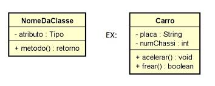

# O que é um Diagrama de Classes

## O que um Diagrama representa ?

Os diagramas representam duas visões distintas de um modelo de sistema:

- **Estático** (estrutural) - estrutura estática por meio de objetos, operaçẽos, relações e atributos
- **Dinâmico** (comportamental) - comportamento dinâmico por meio de colaboração entre os objetos e mudanças de seus estados internos.

## Diagramas UML

### Estruturais

- **Classes**
- Objetos
- Pacotes
- Componenetes
- Implantação
- Estrutura Composta
- Perfil

### Comportamentais

- Caso de Uso
- Sequência
- Comunicação
- Máquina de Estado
- Atividade
- Visão Geral de Interação
- Temporização

## Diagramas de Classes UML

Um diagrama de classes é usado para descrever a estrutura estática de classes no sistema, permitindo definir os **atributos**, operações (**métodos**) e os **relacionamentos** entre as classes.

Apresenta uma visão estática da organização das classes, definindo sua estrutura lógica.

É um dos diagramas mais populares, e serve como base para a construção de outros diagramas UML

Basicamente, descrevem o que deve estar presente no sitema modelado.

## Classes, Atributos e Métodos

Uma **classe** é uma representação de um item do mundo real, físico ou abstrato, na forma de um tipo de dados personalizado.

As classes possuem estruturas internas chamadas de Atributos e de Métodos.

**Atributos** são usados para armazenar os dados dos objetos de uma classe.

**Métodos** são as operações, ou funções que a instância de classe pode executar.

Uma instância de classe é chamad de **Objeto**.

### Exemplo 1

---

Classe: Pessoa

---

Atributos: **Altura**, **Nome**, **Idade**, **Peso**

---

Métodos: **Andar**, **Comer**, **Falar**, **Estudar**, **Dormir**, **Trabalhar**

---

Objeto da Classe (Instância):

---

Atributos:

- Nome: Fabio
- Altura: 1.75m
- Idade: 42
- Peso: 79 Kg

## Representação de uma Classe

Representamos uma classes usando um diagrama divido em três compartimentos:

- Nome: Inclui o nome e o estereótipo da classe (informação sobre a classe)
- Atributos: Lista de atributos da classe no formato **nome:tipo** ou **nome:tipo=valor**
- Operações: Lista de métodos da classe no formato **método(parâmetros):tipo_retorno**

## Visibilidade dos Membros (Atributos/Méotodos)

Representamos a visibilidadedos atributos e dads operações usando os modificadores de acesso a seguir:

- '+' Público
- '#' Protegido
- '-' Privado
- '~' Pacote
- '/' Derivado

### Exemplo diagrama de classe

## Relacionamentos entre Classes

Um Relacionamento é uma conexão entre itens. Existem vários tipos de relacionamentos possíveis entre classes:

- Dependência
- Associação
- Agregação
- Composição
- Generalização

Cada uma desses relacionamentos possui uma representção gráfica específica.
