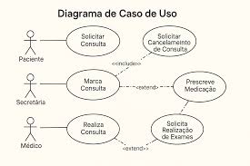
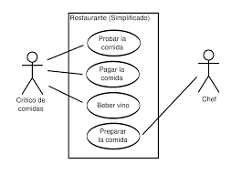

# O que são casos de Uso

## Diagrama UML

### Estruturais

- Classes
- Objetos
- Pacotes
- Componenetes
- Implantação
- Estrutura Composta
- Perfil

### Comportamentais

- **Caso de Uso**
- Sequência
- Comunicação
- Máquina de Estado
- Atividade
- Visão Geral de Interação
- Temporização

## O que são Casos de Uso

Sistemas naõ existem de forma isolada. Há a interação com humanos ou máquinas.

De acordo com Booch, Rumbaugh e Jacobson:

"**Um Caso de Uso especifica o _comportamento_ de um sistema (ou parte), e é uma _descricão_ de um conjutno de sequẽncias de ações para produzir um resultado observável do valor de um _ator_**

Usamos casos de uso para captar o comportamento pretendido de um sistema, sem espcificar como esse comportamenteo é implementado.

### Diagrama de Caso de Usos

Um caso de uso executa uma quantidade especifica de trabalho, realizando algo que seja de valor para um ator, como o cálculo de um resultado, por exemplo.

Casos de uso podem ter variantes - casos de uso que são versões especializadas de outros casos de uso, incluídos como parte de outro caso de uso ou ainda que estendam o comportamento de um caso base.

Representam aspectos do compotamento de uma calsse e modelam Requisitos.

## Aplicações dos Casos de Uso

No geral, empregamos casos de uso com duas finalidades:

1. Definir Escopo - Visualizar e entender as funcionalidades presentes no sistema.
2. Identificar Papíes - Identificar quem interage com o sistema e com quais funcionalidades essa interação ocorre.

Os casos de uso Não são empregados para:

- Detalhar a implementação de funcionalidades.

## A importância dos Casos de Uso

- Permite que os especialistas do domínio especifiquem sua visão externa de modo que desenvolvedores possam construir a visão interna.
- Permitem que os desenvolvedores abordem um elemento e o compreendam - como ele deve ser utilizado.
- Servem como base para testar cada elemento.

## Casos de Uso

### Assunto

Um Assunto é uma classe descrita por um conjunto de casos de uso.

No geral, repesenta um sistema ou um subsistema.

Cada caso de uso modela um comportamente dessa classe, e em conjunto, eles descrevem o comportamenteo completo do assunto.

### Nomes

Todo caso de uso possui um nome que o identifica e diferencia dos demais casos de uso do sistema.

O nome é uma sequência de caracteres de texto, e deve ser único no pacote que o contém.

No geral, os nomes são expressões verbais ativas, que nomeiam um comportamenteo especifico do sistema.

#### Exemplos de nomes de casos de uso

- Fazer pedido
- Pagar Fatura
- Ler Sensor

## Atores

### O que são Atores

Um caso de uso representa um requisisto funcional do sistema, como um todo.

Envolve a interação de atores com o sistema. Um Ator representa um conjunto de papíes que os usuários dos casos de uso desempenham ao interagir com eles.

Atores podem ser humanos, organizações ou aidna sistemas automatizados (equipamentos, outros sistemas, etc.), e são elementos **externos** ao sistema.

### Atores e Casos de Uso

Atores se conectam a casos de uso por relação de associação, indicando que o ator e o caso de uso se comunicam entre si, com a possibilidade de enviarem e receberem mensagens.

Por exemplo, para um caso de uso "**Fazer Pedido**" pode haver um ator "**Cliente**" que se comuncia com o caso de uso por uma associação.

O nome de um ator deve sempre informar seu papel, e não quem é representado.

### Como identificar atores

Podemos identificar os atres que farão parte de um caso de uso fazendo perguntas como:

- Que organizações, pessoas ou entidades vão usar o sistema ou são importantes para realização de funções ?
- Quais sistemas se comunicam com o sistema desenvolvido ?
- Quem pode se interessar por algum requisito funcional do sistema ?
- Quem deve receber informações sobre ocorrência no sistema.

Atores semelhantes devem ser organizados em uma hierarquia de generalização/ especialização (Herença).

### Como identificar Casos de Uso

Para identificar casos de uso, podemos fazer perguntas como:

- Quais as funcionalidades pretendiads para o sistema ?
- Elencar as necessidades e os objetivos de cada ator em relação ao sistema.
- Quais informações o sistema precisa retornar?
- O sistema precisa realizar ações que se repetem no tempo ?
- Considerando os requisitos funcionais, determinar um ou mais casos de uso que os impelementem.

## Relacionamentos

Entre casos de uso e atores: Associação

Entre casos de usos:

- Generalização
- Extensão/ Estendido (extends)
- Inclusão (includes)

Ja entre os atores podemos ter o relacionamento de Generalização

## Fluxo de Eventos

Especificamos o comportamento de um caso de uso com um **Fluxo de Eventos**. Nele incluiremos:

- Quando e como o caso de uso se inicia e trmina
- Quando ele interage com os atores
- Os objetos transferidos.
- Fluxo básico e fluxos alternativos do comportamentos.

obs: Os fluxos de eventos podem ser especificados de várias maneiras, como:

- Texto informal(nosso exemplo)
- Tabela com pré e pós condições
- Máquinas de estado
- Diagramas de atividades
- Pseudocódigo.

### Exemplo de Fluxo de Eventos

#### Validar Usuário

##### Fluxo Principal

- Sistema solicita ao cliente seu número de identificação (ID) e uma senha de acesso.
- Cliente digita seu ID e senha em um teclado numérico.
- Cliente confrima as entradas, pressionando Enter.
- Sistema verifica ID e senhas fornecidos.
- Se ID for válido e senha corresponder, sistema reconhece usuário, permitindo sua entrada, finalizando caso de uso.

###### Fluxo alternativo

- Cliente cancela transação a qualquer momento, pressionaodn um botão Cancelar, exibido na tela.
- Não são realizadas alternações na conta do cliente
- Caso de uso é finalizado.

Também existe o Fluxo de Exceção, empregado para descrever possíveis restrições do sistema, como por exemplo não aceitar cartão com validade vencida.
